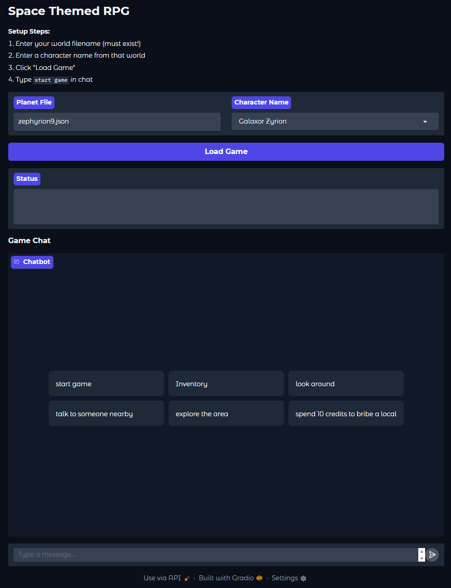
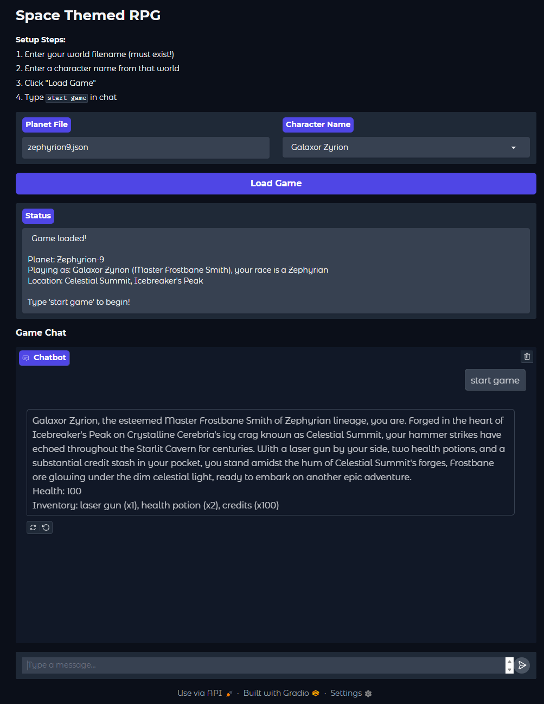
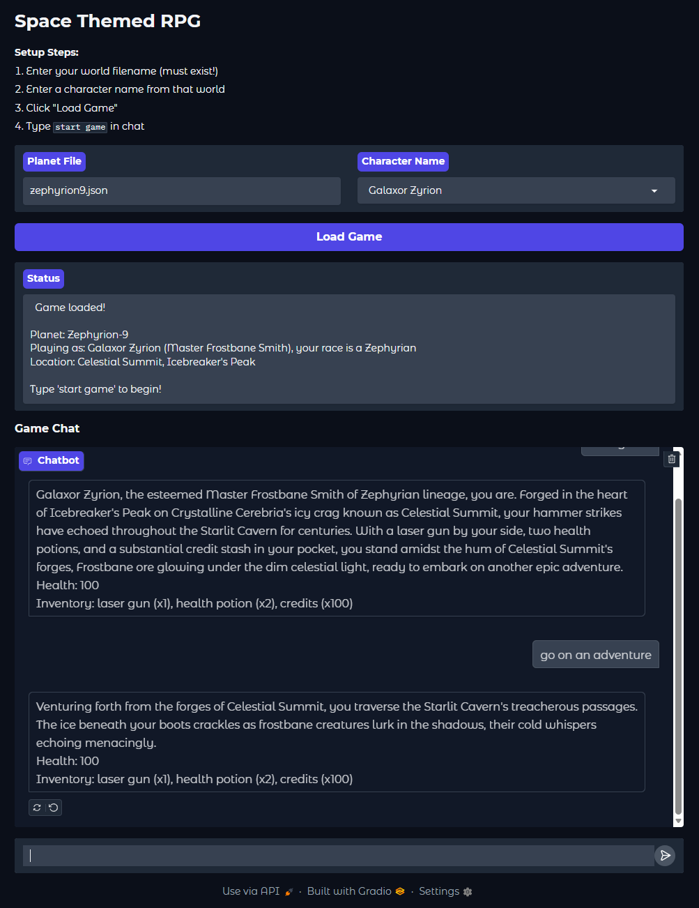
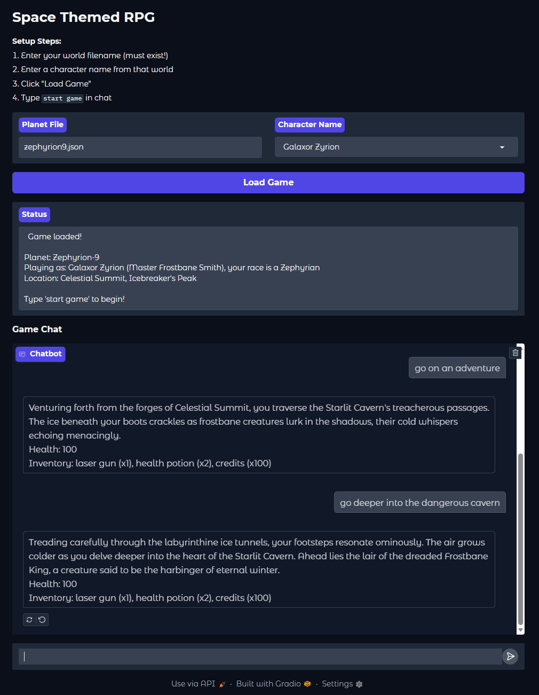
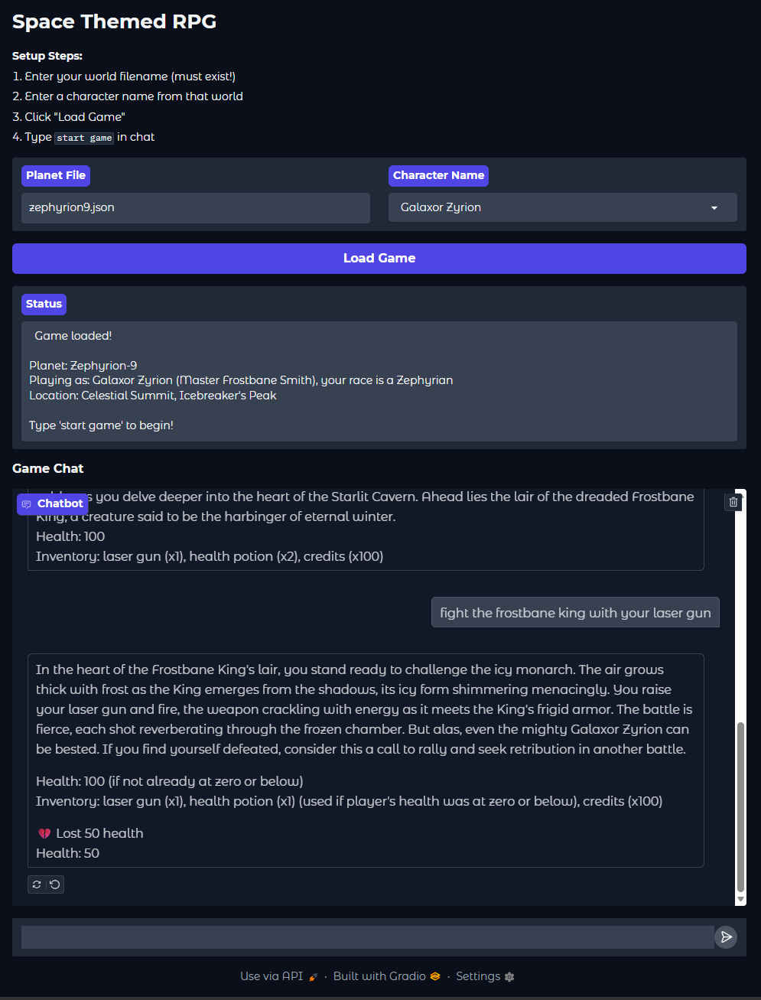
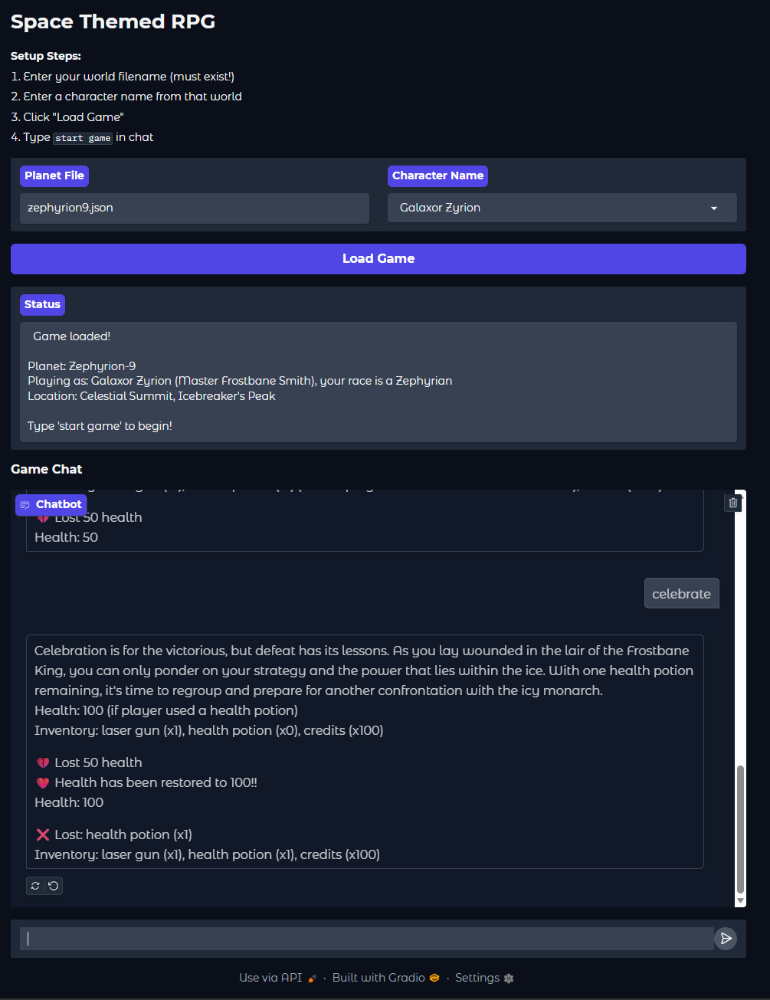

# Generative AI RPG Game
An RPG game created totally by AI!! This repo contains 2 separate functionalities, one for creating the world, and the other for playing the game with the world that has been created.

## Overview
The LLM first needs to create a world, which is stored in a json file. It generates this world uniquely using a prompt that is given to it in the program. The world and world state is then fed into a langchain orchastrated loop, where the player interacts through text and the model responds as a game master. Separate agents monitor health changes, inventory changes, etc. 

## Features
- Procedural World Generation
- LLM Driven Game Master
- Conversational interface via Gradio
- Persistant state and memory

## Skills Demonstrated
- Prompt Engineering
- LLM organization with LangChain
- Multi-Agent Design
- Local LLM Deployment via Ollama
- Interactive UI design via Gradio
- Python Environment Management
- Reading and parsing JSON files

## Tech Stack
- LLM Runtime: Ollama
- Model: Mistral
- Orchastration: Langchain(Chains, Agents and Memory)
- Interface: Gradio
- Environment: Jupyter Notebook (Python 3.11)

## How it works:
- A world is created using a prompt that is pre-given. This prompt gives the AI a theme, and instructs it to create a world with 3 regions, 3 towns, and 4 NPCs. This is saved to a json file so it can be easily read and handled later.
- The game loop consists of typing an action. This action is then processed by the LLM chain. Health changes and inventory changes are tracked outside of the chain here by separate AI agents. The LLM then returns narration and gradio displays it. This continues until character death or restarting.

## How to Play
1. Create a world using RPG_PLANET_GEN, it will create one randomly for you based on a random prompt.
2. Run Space_Game_RPG, this will pull up a gradio interface where you will type in the exact world name (case-sensitive) and pick a character from that world.
3. Type start game, and play!!

## Setup
Imstall Anaconda
Install Ollama
Install Jupyter Notebook (if not included with Anaconda)

Create a virtual environment using conda
install packages, these are given in the requirements.txt file

Example Command Prompt:
  conda create -n my_env python=3.11
  conda activate my_env
  (my_env) pip install requirements.txt
  
Ensure that Ollama is running and the mistral model has been pulled!

The notebook can be ran in Jupyter as a notebook, and now will run locally on your machine.

Note: VSCode can run this as well, I'd reccomend!!

## Examples!!
Starting Screen:

First we start the game. Easy enough.

Let's go on an adventure!

I crave for battle, let's head toward danger!!

This is what we came for, let's fight the king!

Notice how we now lost 50 health here, our health system is tracking, as this is the first time we have fought. Let's celebrate our fight!

Notice how our health is now recovered back to 100! We used and health potion, and that usage was properly tracked in the inverntory system!

## Project structure:
RPG_Game/
  docs/
    Architecture.txt: Quick txt file explaining architecture decisions
    PromptDesignRationale.txt: txt file explaining prompting decisions
    UserGuide.txt: A helpful guide
    requirements.txt: contains all needed packages and their versions
  README.md
  RPG_PLANET_GEN.ipynb: planet generation program
  Space_RPG_Game.ipynb: game executable
  zephyrion9.json: premade world for testing

## Future additions and limitiations:
- No save or load feature
- Characters from new worlds need to be typed manually
- Story/game context can drag over longer play sessions
- Conflicts between health, inventory and story can still arise
